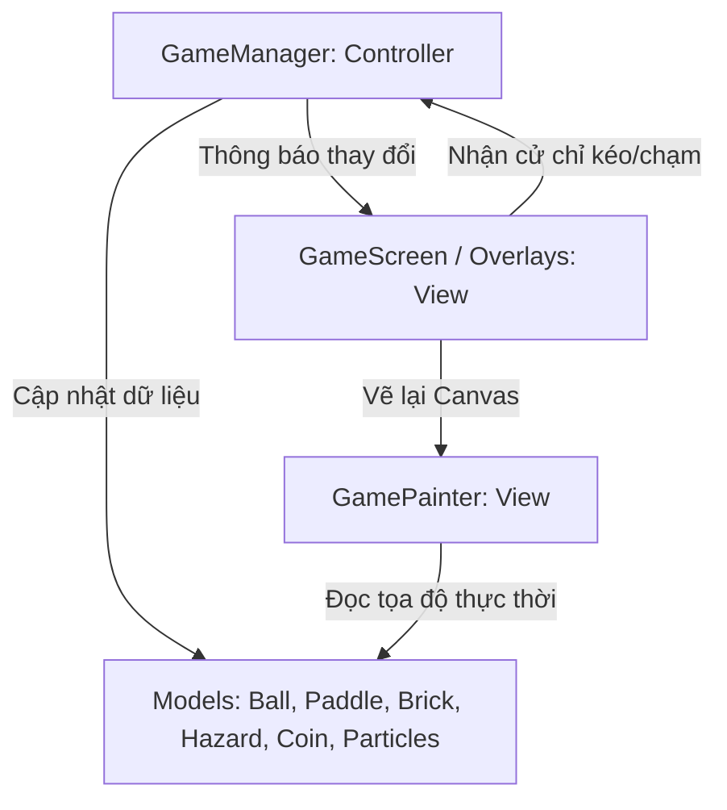

# 📝 TÀI LIỆU THIẾT KẾ VÀ KIẾN TRÚC GAME: NEON BREAKOUT

Tài liệu này đặc tả chi tiết toàn bộ thiết kế, luật chơi, động cơ vật lý, hệ thống âm thanh, cấu trúc 20 màn chơi và kiến trúc mã nguồn của game **Neon Breakout** trong Flutter. Một lập trình viên hoặc AI chỉ cần đọc tài liệu này là có thể tái lập trình hoàn chỉnh toàn bộ game từ đầu đến cuối mà không cần thêm bất kỳ thông tin nào khác.

---

## 1. TỔNG QUAN VỀ GAME (GAME OVERVIEW)

- **Thể loại:** Casual Arcade Brick Breaker (Bắn bóng phá gạch).
- **Chủ đề nghệ thuật (Art Style):** Retro Cyberpunk/Neon. Tông màu chủ đạo là neon rực rỡ (Cyan, Pink, Magenta, Amber, Lime Green) phát sáng nổi bật trên nền tối (`#0F0E17`). Hiệu ứng rung lắc màn hình và hệ thống phát sinh hạt bụi phát sáng (Particle System) tạo cảm giác cực kỳ đã mắt (Juice).
- **Âm thanh và Nhạc nền:**
  - **BGM (Nhạc nền):** Gồm 8 bản nhạc EDM chất lượng cao phát ngẫu nhiên mỗi lần bắt đầu game, qua màn hoặc nhấn chơi lại.
  - **SFX (Hiệu ứng âm thanh):** Tổng hợp bằng thuật toán toán học thời gian thực (sinh mã PCM lưu thành tệp tin `.wav` nội bộ trong dự án), không tải từ internet hoặc file ngoài để tránh lỗi CORS và bản quyền. Gồm 5 âm thanh retro chiptune: va chạm gạch/tường, ăn xu, nhặt buff, thua cuộc/bom nổ và thắng màn.

---

## 2. DESIGN PATTERN & KIẾN TRÚC HỆ THỐNG

Dự án tuân thủ mô hình kiến trúc **MVC (Model-View-Controller)** kết hợp cơ chế quản lý trạng thái **ChangeNotifier** gốc của Flutter:

### A. GameManager (Controller + State Manager)
Lớp kế thừa `ChangeNotifier` quản lý toàn bộ vòng lặp game (Game Loop) tốc độ 60FPS:
- Cập nhật tọa độ của bóng, thanh trượt, tiền rơi, chướng ngại vật rơi, và các hạt bụi.
- Quản lý trạng thái chơi: `menu` (màn hình chính), `playing` (đang chơi), `paused` (tạm dừng), `gameOver` (thua cuộc), `levelComplete` (chiến thắng màn).
- Lưu giữ điểm số cao nhất (`highScore`), số lượng coin tích lũy (`coins`) và màn chơi cao nhất được mở khóa (`maxUnlockedLevel`) vĩnh viễn qua `SharedPreferences`.

### B. PhysicsEngine (Động cơ Vật lý)
Xử lý va chạm dựa trên hình học AABB (Axis-Aligned Bounding Box) cho gạch/thanh trượt và hình tròn (Circle) cho bóng:
- **Va chạm thanh trượt:** Tính toán tỉ lệ khoảng cách va chạm từ tâm thanh trượt để điều hướng bóng phản xạ (Hit Factor từ `-1.0` đến `1.0`).
- **Va chạm gạch (Chống kẹt khiên chắn):** Để giải quyết triệt để lỗi bóng bị kẹt nảy vô hạn bên trong gạch Unbreakable, động cơ áp dụng **bảo vệ hướng (Directional Guard)** và **bù tọa độ đẩy ra ngoài (Position Snapping)**:
  - Chỉ tính va chạm nếu bóng đang bay hướng về phía gạch (Ví dụ: Chỉ nảy Y và đẩy bóng lên trên nếu va chạm ở cạnh trên và bóng đang rơi xuống `vy > 0`).
  - Khi va chạm xảy ra, bóng lập tức được gán tọa độ nằm sát rìa ngoài của gạch (snap position) để không bao giờ bị đè lún sâu vào bên trong gạch ở khung hình kế tiếp.

### C. GamePainter (Canvas View)
Sử dụng `CustomPainter` vẽ trực tiếp lên màn hình:
- Tận dụng `Paint.imageFilter` hoặc vẽ các vòng tròn mờ chồng lấn tạo hiệu ứng phát sáng neon (Neon Glow).
- Vẽ các skins bóng (Plasma Cyan, Fiery Orange) và skins thanh trượt (Gold Star, Green Sparkle) kết hợp hạt đuôi phát sáng tương ứng.
- Vẽ bom rơi (đỏ neon có gai), chữ X tím (Glitch Orb) và gạch Unbreakable (metallic neon bạc cứng cáp).

---

## 3. CƠ CHẾ GAMEPLAY CHI TIẾT

### A. Các loại gạch (Brick Types)
Lưới chơi gồm 10 cột. Mỗi viên gạch có kích thước responsive dựa trên chiều rộng màn hình:
1. **Gạch thường (Normal):** 1 máu, sơn màu neon ngẫu nhiên đổi màu khi phá.
2. **Gạch bọc thép (Armored):** 2 máu. Lần va chạm đầu tiên biến đổi nứt vỡ sang gạch thường, lần hai bị tiêu diệt.
3. **Gạch thuốc nổ (Explosive):** 1 máu, khi nổ sẽ kích nổ dây chuyền tất cả gạch xung quanh trong bán kính 80 pixel.
4. **Khiên chắn Unbreakable:** Không thể phá hủy, bóng va vào chỉ nảy lại.

### B. Cơ chế rơi vật phẩm (Drops)
Khi phá hủy gạch thường/bọc thép/thuốc nổ, có tỷ lệ rơi:
- **25% rơi Coin:** Nhặt được +1 Coin vào túi.
- **12% rơi Power-up:**
  - `Multi-ball` (Xanh lá): Nhân 3 số bóng hiện tại.
  - `Wide Paddle` (Xanh dương): Thanh trượt dài gấp 1.5 lần trong 8 giây.
  - `Slow Motion` (Xanh lục bảo): Bóng bay chậm hơn trong 8 giây.

### C. Chướng ngại vật nguy hiểm (Hazards - Chỉ xuất hiện từ Level 11+)
Khi phá gạch ở các level cao, có tỷ lệ rơi các mối hiểm họa:
- **10% rơi Bom (Spiked Bomb - Quả cầu gai đỏ):** Trúng thanh trượt sẽ làm **trừ 1 mạng**, gây rung màn hình mạnh, ngắt điểm combo của người chơi.
- **10% rơi Cầu lệch góc (Glitch Orb - Chữ X tím):** Trúng thanh trượt sẽ kích hoạt trạng thái **báo động Glitch đường bóng trong 7 giây**. Trong thời gian này, mọi va chạm của bóng sẽ ngẫu nhiên làm lệch góc bay ban đầu một khoảng từ `[-15°, +15°]`. Bóng sẽ nhấp nháy tím và màn hình hiển thị thanh đếm ngược.

---

## 4. HỆ THỐNG 20 BẢN ĐỒ HANDCRAFTED (LEVEL SPECIFICATION)

Lưới chơi được đặc tả cố định **10 cột (Columns)**. Tất cả các khiên chắn Unbreakable (ký hiệu số 4) phải được sắp xếp chừa ra các khe hở **rộng tối thiểu 2 ô gạch** (khoảng ~60px) để quả bóng (đường kính 16px) có thể luồn lách qua mà không bị nghẽn góc nảy.

### Phân nhóm 4 Tiers độ khó:
- **Tier 1 (Lv 1-5): Basics.** Không khiên chắn, không bom.
  - *Lv 1:* Lưới gạch cơ bản.
  - *Lv 2:* Hình trái tim neon đỏ.
  - *Lv 3:* Hình Kim tự tháp neon.
  - *Lv 4:* Hai tòa tháp gạch hai bên, giữa trống.
  - *Lv 5:* Bàn cờ vua xen kẽ gạch thường và gạch bọc thép.
- **Tier 2 (Lv 6-10): Shields.** Xuất hiện khiên chắn Unbreakable.
  - *Lv 6:* Bức tường khiên chắn nằm ngang chia đôi lưới, chừa 2 lối vào rộng ở giữa và hai rìa.
  - *Lv 7:* Hình quái vật Space Invader có hai khiên Unbreakable bảo vệ hai cánh.
  - *Lv 8:* Đường hầm xoắn ốc bằng khiên chắn, người chơi phải bắn bóng lọt qua khe giữa trên cùng để ăn gạch bên trong.
  - *Lv 9:* Hình thoi Unbreakable bảo vệ lõi gạch nổ ở giữa, chừa lối vào ở góc chéo.
  - *Lv 10:* Phễu đồng hồ cát Unbreakable, ép bóng đi qua đúng lỗ eo ở giữa.
- **Tier 3 (Lv 11-15): Hazards.** Bật cơ chế rơi bom và cầu lệch góc Glitch.
  - *Lv 11:* Màn bão bom với nhiều gạch nổ xen kẽ.
  - *Lv 12:* Các cột khiên Unbreakable dựng đứng chia dọc màn hình thành các khe hẹp.
  - *Lv 13:* Mỏ bom với 2 hàng gạch nổ xếp sát nhau ở trên cùng.
  - *Lv 14:* Mê cung ziczac ép bóng di chuyển vòng vèo qua các vách Unbreakable nằm so le.
  - *Lv 15:* Các phòng chứa gạch hình vuông bị bịt kín bởi Unbreakable, chỉ hở góc.
- **Tier 4 (Lv 16-20): Chaos.** Tốc độ bóng đẩy lên cao nhất, khiên chắn dày đặc kết hợp bom rơi liên tục.
  - *Lv 16:* Chiếc lồng Unbreakable giam cầm bóng, chỉ hở 2 khe ở góc đáy để bóng đi ra đi vào.
  - *Lv 17:* Pháo đài Zig-zag bảo vệ nghiêm ngặt lõi thuốc nổ trung tâm.
  - *Lv 18:* Mê cung lửa chéo đan xen khiên Unbreakable và gạch nổ.
  - *Lv 19:* Pháo đài sắt bịt kín phần trên, chỉ để hở lối vào duy nhất rộng 2 ô gạch ở chính giữa đáy.
  - *Lv 20: The Grand Finale.* Trận chiến cuối cùng kết hợp tất cả các cơ chế: khiên Unbreakable xếp so le bao quanh các lõi gạch nổ nguy hiểm và gạch bọc thép dày đặc.

---

## 5. HƯỚNG DẪN CẤU TRÚC CODE CHI TIẾT TỪNG FILE

### A. Models
- `ball.dart`: Chứa tọa độ (`position`), vận tốc (`velocity`), bán kính (`radius`), màu sắc, góc quay, và các hàm di chuyển (`update`), đổi hướng (`bounceX`, `bounceY`, `bounceOffPaddle`).
- `brick.dart`: Chứa `rect` (tọa độ hình chữ nhật), loại gạch (`type` - normal, armored, explosive, unbreakable), lượng máu còn lại, trạng thái phá hủy (`isDestroyed`). Hàm `hit()` trả về `true` nếu gạch bị phá hủy hoàn toàn.
- `paddle.dart`: Quản lý tọa độ X thanh trượt (`positionX`), độ rộng (`width`), chiều cao (`height`), màu sắc. Hàm `getRect(double screenHeight)` trả về vùng va chạm thực tế của thanh trượt.
- `coin.dart` & `hazard.dart` & `power_up.dart`: Các thực thể rơi tự do theo trục Y (`position += Offset(0, speed * deltaTime)`).
- `particle.dart`: Quản lý từng hạt bụi ánh sáng tự do có vận tốc, độ mờ (`opacity`), kích thước và tuổi thọ giảm dần theo thời gian.

### B. Physics Engine (`physics.dart`)
Chứa các hàm tĩnh xử lý va chạm:
- `checkBoundaryCollision(ball, width, height)`: Kiểm tra bóng chạm viền trái/phải/trên để nảy lại, rơi xuống dưới đáy thì trả về trạng thái thất bại.
- `checkPaddleCollision(ball, paddle, screenHeight)`: Đón bóng chạm mặt trên thanh trượt và đổi góc bay dựa trên khoảng cách va chạm từ tâm thanh trượt.
- `checkBrickCollision(ball, brick)`: Thực hiện thuật toán va chạm gạch chống kẹt bóng đã nêu ở Mục 2.B.

### C. Audio Controller (`audio_controller.dart`)
- Sử dụng thư viện `audioplayers` để phát nhạc và tiếng động.
- Nạp danh sách 8 bài EDM từ thư mục local `assets/audio/neon_bgm_[1-8].mp3` và phát ngẫu nhiên.
- Phát hiệu ứng âm thanh từ các tệp tin chiptune local `assets/audio/sfx_[hit/coin/buff/win/lose].wav` bằng `AssetSource`.

### D. Level Manager (`level_manager.dart`)
Định nghĩa hàm tĩnh `buildLevel(int level, double screenWidth)` trả về danh sách gạch của màn tương ứng dựa trên lưới số nguyên 10 cột đã thiết kế ở Mục 4.

### E. Game Manager (`game_manager.dart`)
- Quản lý vòng lặp game chính `update(double deltaTime)` cập nhật các thực thể, xử lý va chạm, đếm ngược thời gian tác dụng của Buff (Wide paddle, Slow motion) và Debuff (Glitch trajectory).
- Phương thức `_handleBrickDestruction(brick)` để cộng điểm, kích nổ nếu là gạch explosive, sinh ngẫu nhiên tiền vàng, buff hoặc chướng ngại vật rơi.
- Tích hợp hàm `saveGameStats()` lưu trữ và nạp thông số điểm cao, tiền xu và mở khóa màn chơi.

### F. View & UI (`game_painter.dart`, `game_screen.dart`, `overlays/*`)
- `game_painter.dart`: Vẽ toàn bộ các thành phần game lên CustomPaint.
- `game_screen.dart`: Cài đặt bộ Ticker 60FPS kích hoạt vẽ lại màn hình liên tục.
- `overlays/*`: Giao diện Menu chính (gồm nút Start, Chọn Map, Vào Shop), Menu Chọn màn chơi (dạng lưới 20 ô kèm biểu tượng khóa 🔒), cosmetic shop mua skins bóng/thanh trượt, và màn hình Pause/Game Over/Level Complete.
